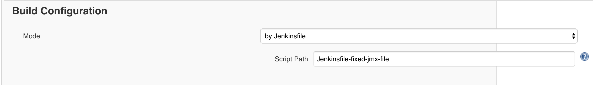

# java-maven-jmeter
Java project using a maven plugin of JMeter, allowing for automated performance tests easily integrated in pipelines. 
In addition, a Selenium WebDriver script can be used to log in to the system under test, 
store the cookies and pass that cookies in a following HTTP request by JMeter or in an API test using REST.

## Installation
For installation and use of this project, the following components are necessary:

- JDK 1.8
- Maven
- Java IDE (optional but strongly suggested)
- JMeter
- Jenkins (optional)
- Google chrome (optional)

## Usage

### Usage without need for selenium-based authentication
If you do not need any authentication via a Selenium script in your JMeter test, or if your JMeter test has authentication built in, just edit the example JMX file or add your own JMX file(s). 
Then navigate to the root folder of the project and run the following command:
```
mvn clean verify -P exclude-selenium -DjmxFile=examples-performance-test
```
Wildcards are permitted in specifying the jmx file. I.e.
```
mvn clean verify -P exclude-selenium -DjmxFile=examples-performance-test*
```
will execute both the 'examples-performance-test' and the 'examples-performance-test-duplicate' JMeter tests.

### Usage with need for selenium-based authentication
If you need to authenticate before executing the JMeter test(s) using a Selenium WebDriver script, then the following steps have to be made:

1. Edit the LoginPage code and application url to meet the authentication requirements for your system under test. 
Edit the application URL in Constants.java.
Edit the 'login' method in LoginPage.java.

2. Start a local selenium hub and node
The selenium standalone jar is included in the project root directory. In order to start the local hub and node, execute the following commands:
```
java -jar selenium-server-standalone-3.141.59.jar -role hub
java -jar selenium-server-standalone-3.141.59.jar -role node
```
_Note: these commands need a separate terminal window because the processes will keep running._

3. Include credentials
There are two possible ways of including credentials. The first way is to include them in the command using maven properties 'testEnvUsr' and 'testEnvPwd', i.e.
```
mvn clean verify -P include-selenium -DjmxFile=examples-test-my-application -DtestEnvUsr=admin -DtestEnvPwd=admin
```

The second way is to create a file called secrets.properties. Copy the file called 'secrets.properties.temp' and rename it to 'secrets.properties'. Then enter the credentials in this file using the 'test.usr' and 'test.pwd' lines.

4. Run the application using the selenium profile:
With or without credentials as maven properties:
```
mvn clean verify -P include-selenium -DjmxFile=examples-test-my-application -DtestEnvUsr=admin -DtestEnvPwd=admin
mvn clean verify -P include-selenium -DjmxFile=examples-test-my-application
```
_Note: the project uses a remote ChromeDriver. Feel free to use your own preferred variant of WebDriver if necessary._

## Results
After a successful execution of the performance test(s), results will be present in the **target/jmeter/results** folder.

## Integration with Jenkins
One of the benefits of the maven JMeter plugin, is that it is easily integrated in CI, such as Jenkins. 
There are two Jenkinsfiles already present in the project, one in which the JMX file can be specified as a parameter in Jenkins, and one in which the JMX file is fixed.
In order to use these Jenkinsfiles in your jenkins environment, follow these steps:

- (If using authentication) Add valid credentials of your test environment as Jenkins credentials. 
The ID of these credentials has to correspond with the value of the TEST_ENV parameter in the jenkinsfile, i.e. if you add the credentials with ID 'testEnv', make sure the 'environment' part of your jenkinsfile includes the following:
```
environment {
    TEST_ENV = credentials('testEnv')
}
```
- Create a new pipeline or multi-branch pipeline job in jenkins and set the script path to the coresponding Jenkinsfile, 
i.e. to use the 'Jenkinsfile-fixed-jmx-file' Jenkinsfile, your jenkins 'Build configuration' should look like this:



